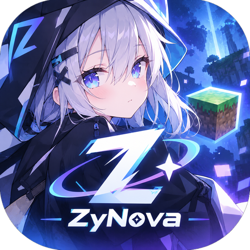

<p align="center">
  
</p>

# ZyNova

> **Minecraft: Java Edition · Android Launcher**
>
> An independent, unofficial project based on the open-source code of ZalithLauncher2

[](https://developer.android.com/)
[](https://kotlinlang.org/)
[](https://www.gnu.org/licenses/gpl-3.0.html)
[](https://github.com/zzy89216-gif/ZyNova/releases/tag/v27.1.2)

**[English](README.md)** | [简体中文](README_ZH_CN.md) | [繁體中文](README_ZH_TW.md) | [日本語](README_JA_JP.md)

---

## ✦ About

**ZyNova** is an **unofficial** Minecraft: Java Edition launcher for Android, built on the
open-source code of [ZalithLauncher2](https://github.com/ZalithLauncher/ZalithLauncher2).

> **ZyNova is NOT an official version of ZalithLauncher2.**
>
> ZyNova is an unofficial modified project based on ZalithLauncher2's open-source code.
>
> It ships with a **built-in AI Agent** that can really read your logs, manage mods, edit
> configs, install resources and launch the game for you — not just give advice.

- GitHub: <https://github.com/zzy89216-gif/ZyNova>
- Issues: <https://github.com/zzy89216-gif/ZyNova/issues>
- Discord: <https://discord.gg/QwPpZQHrTa> (permanent invite)

---

## ✨ Highlights of 27.1.2

- **The upstream Client ID is gone — including from the Git history.** At the upstream
  ZalithLauncher2 project's request, their Microsoft application registration ID no longer appears
  anywhere in this repository, and the history has been rewritten to purge it (3 commits removed;
  a full object scan now returns zero hits). **All commit hashes and tags have therefore changed**,
  so old clones must be fetched again.
- **AI: you can now see where your data goes.** The first time you open the AI settings, the app
  explains that game logs, mod lists, configuration contents and the text you type are sent to the
  provider you configured, that ZyNova neither stores nor relays them, and that your API key stays
  on this device.
- **AI: operation audit log.** Every write operation the agent performs is recorded locally
  (time, tool, risk, arguments, result) and can be reviewed or exported from the AI settings.
- **The agent permission mode now defaults to "confirm each operation"**, so a brand-new user is
  asked before the AI changes settings, deletes mods, writes files or installs resources.
- **The OpenGL version selector is back** for Ironized Zink (4.6 / 4.5 / 4.3 / 3.3). All four
  official presets use 4.6, and devices whose drivers translate Vulkan to Zink 4.6 imperfectly had
  no way to lower it. The other twelve low-level parameters stay hidden.

## ✨ Highlights of 27.1.1

- **No more tool-call limit.** The agent used to stop after 12 rounds; now it keeps working until
  the model itself decides it is done, and you can press **Stop** at any time. The only guard left
  is a *repeat guard*: if the same tool is called with exactly the same arguments more than six
  times, it is treated as a loop and stopped.
- **Conversation history with a sidebar.** Chats are saved on your device and survive restarts.
  Pull the sidebar from the top-left corner to review, switch, delete or start a new conversation.
- **UI polish.** A running tool is now shown while it works (long installs no longer look like a
  freeze), auto-scroll only follows when you are already at the bottom, you can send from the
  keyboard, and clearing a chat asks for confirmation first.
- **Fixed.** Pressing *Stop* now interrupts the stream immediately; `read_log` can no longer be
  tricked into reading files outside the allowed directories; very large logs no longer risk an
  out-of-memory crash; switching conversations can no longer write old messages into the new one.
- **Localisation.** All user-visible AI error messages are now translated
  (English / 简体中文 / 繁體中文 / 日本語), and the assistant replies in the language you write in.

## ✨ Highlights of 27.1.0

- **A global AI Agent.** A new **AI** button sits next to the file entry in the top bar and opens
  the chat screen directly — there is no separate AI home page. Chat and Agent are **the same
  entry point**: ask *"why won't this instance launch?"* and it goes and reads the logs; then say
  *"fix it for me"* and it **calls tools and actually does it**, instead of writing you a tutorial.
- **The AI can really act on your launcher.** 25 tools, all built on top of the launcher's existing
  systems: instances, real mod metadata, enabling / disabling / deleting mods, resource packs,
  shaders, saves, files, logs, crash reports, **118 launcher settings**, resource search and install
  (including recursive installation of required dependencies), and **actually launching the game**.
- **AI settings are completely separate from the launcher settings.** Provider
  (OpenAI / Anthropic, extensible), your own API key (stored locally only), model selection
  **fetched dynamically from the provider — no model name is hard-coded anywhere**, a customisable
  base URL, and an agent permission mode (full control / confirm each operation).
- **Fixed: silent failures when auto-installing dependencies.** Five separate defects all produced
  the same symptom — the UI said "installed successfully", and the game then crashed because a
  required dependency had never been installed.

## ✨ Highlights of 26.4.2

- **Premium sign-in now uses ZyNova's own Microsoft application registration.** The 26.4.0 and
  26.4.1 builds had to borrow the registration of the **upstream ZalithLauncher2 project**, because
  only a registration that is on Minecraft's application allow list may talk to Minecraft Services.
  From 26.4.2 on, the launcher is built with **ZyNova's own registration**.
- **New app icon.** Every icon variant was replaced with the new ZyNova artwork: the
  **adaptive icon** (background / foreground / monochrome layers), the **legacy square and round
  icons** at all densities, and the **Google Play 512×512 icon**. The artwork sits inside the
  adaptive icon's visible area, so the character and the `ZyNova` wordmark stay **fully visible
  and uncropped**. The in-app extraction screen shown on first launch is **left untouched**.

### ℹ️ Which Microsoft application is used for sign-in

**ZyNova is an unofficial fork of ZalithLauncher2 — they are different projects, maintained
independently.** The two registrations involved are:

| | Display name | Client ID | Mojang allow list | Used by this build |
|---|---|---|---|---|
| **ZyNova's own app registration** | ZyNova Launcher | `7b66e168-f8cd-43fc-a52d-2e78dba189b0` | ✅ **approved (2026-09-30)** | ✅ yes |
| **ZalithLauncher2's app registration** | ZalithLauncher (upstream) | (removed) | ✅ approved | ❌ no (used by the 26.4.0 / 26.4.1 builds) |

- Only an application registration that is on **Minecraft's application allow list** can complete
  premium sign-in. Otherwise `POST /authentication/login_with_xbox` answers
  `403 Invalid app registration, see https://aka.ms/AppRegInfo`, no matter how OAuth, Xbox Live and
  XSTS went.
- ✅ **ZyNova's own registration is on that allow list.** The Mojang Enforcement AppID review was
  completed on **2026-09-30** and stated that the submission in that batch
  *"met the required criteria and have been approved for our allow list"*.
  **Premium sign-in therefore works with the current builds — ZyNova no longer borrows the
  upstream project's registration.**
- The Client ID is **injected at build time** through the repository secret `OAUTH_CLIENT_ID`;
  it is never hard-coded in the source. Its priority is
  **environment variable (CI secret) > `.oauth_client_id.txt` > `ZalithLauncher/gradle.properties`**.
- **What you will see:** the sign-in appears in your Microsoft account's
  *Connected apps / Apps and devices* page under the display name listed above.
- Still required: **public client + Client ID only**. No Client Secret, no redirect URI, no SHA-1.

## ✨ Highlights of 26.4.1

- **Microsoft (premium) sign-in works again.** 26.4.0 could stop at the Minecraft Services
  step after Microsoft OAuth, Xbox Live and XSTS had all succeeded, and the real cause turned
  out to be a **Mojang-side application allow list** — Minecraft Services answered
  `403 Invalid app registration, see https://aka.ms/AppRegInfo`. Nothing was wrong with the
  code, the Entra configuration, the IP, the network, the request rate or the account.
  26.4.1 shipped with a **Microsoft application registration that Mojang has already approved**,
  so premium sign-in completed; 26.4.2 moves to ZyNova's own registration (see above).
- **A failed sign-in no longer loses the real error.** Previously the log only ever showed an
  exception whose `message` was permanently `null` (`il6: null`) — the HTTP status code and the
  server's response body were never recorded, and **every** HTTP 403 was reported in the UI as
  "The current IP address has been blocked from logging in". The launcher now logs the request URL,
  the real HTTP status code, the response body (the non-2xx error JSON, which never contains an
  `access_token`) and the full stack trace for both `login_with_xbox` and `getPlayerProfile`.
- **403 is no longer misattributed.** Minecraft Services uses 403 for two very different things:
  `BLOCKED_IP` and `Invalid app registration`. The two are now told apart by the response body,
  and the second one gets its own message instead of sending users off to change their network.

## ✨ Highlights of 26.4.0

- **Microsoft (premium) sign-in is back**: the account login menu offers **Microsoft** again.
  It uses the OAuth 2.0 **device code flow** — the launcher fetches a device code, copies it to
  the clipboard, opens the verification page, and then polls for the token.
  The authentication backend was never removed: 26.1.0 only cut the UI and ViewModel wiring,
  which this release restores. **No Client Secret, no redirect URI and no SHA-1 are required**,
  and the public OAuth Client ID ships inside the APK as designed.
- **Fixed the empty "Category" filter on the download page** (Issue #6):
  under the default "All platforms" mode the category list now follows the reference source
  (CurseForge) instead of being cleared, and the category condition is only sent to that source,
  so a category ID is never handed to a source it does not belong to.
  When more than one source is queried the filter title says so, e.g. "Category (CurseForge only)".
- **Fixed the missing resource-type badge on result cards** (Issue #6):
  the search result list failed to pass the `classes` argument down to the card layout, so the
  mod / resource pack / shader / world / modpack badge never rendered — while the detail page,
  which did pass it, showed the badge correctly.
- **Ironized Zink now exposes only its 4 official presets** (Issue #7):
  the OpenGL version dropdown and the 12 parameter switches were removed, so ordinary users no
  longer have to tune low-level parameters. Selecting a preset still writes the whole parameter set.
  ⚠️ All four presets pin the OpenGL version to 4.6, so new users can no longer lower it to
  4.5 / 4.3 / 3.3; values already saved by users who tuned parameters during 26.3.0 keep working.

## ✨ Highlights of 26.3.0

- **Renderer overhaul — only three built-in renderers remain**:
  **Ironized Zink** (now the default), **GL4ES** and **MobileGlues**.
  Removed: Krypton Wrapper (NG-GL4ES), Kopper Zink, VirGL, Freedreno and Panfrost,
  together with the native libraries that only they used.
- **Ironized Zink is fully integrated**: all **13 tunable parameters** and the
  **4 official presets** (Potato / Performance / Default / Max Compatibility),
  ported from upstream (by GoyDevv, GPL-3.0). Selecting it in **Settings → Renderer**
  immediately expands the configuration panel right below.
  *(26.4.0 later reduced that panel to the 4 presets only — see the highlights above.)*
- **Default renderer is now Ironized Zink with the Default preset.**
- **Fixed cards drifting while scrolling the home page** — the page scroll was being
  mistaken for a reorder "make way" shift, so every card animated itself out of place.
- **One universal APK only** (all four ABIs in a single build, code obfuscation kept).
- **Per-component license notices** — see [THIRD_PARTY_NOTICES.md](THIRD_PARTY_NOTICES.md).
- **External renderer plugins are unaffected**: FCL / Zalith renderer plugins and
  `fclPlugin_V2` plugins can still add more renderers to the list.

## ✨ Highlights of 26.2.6

- **Fixed** cards being pushed to the wrong place after drag reordering
  (the offset modifier was applied inside `clip` / `background`, and an interrupted
  make-way animation could leave a permanent offset behind)
- **Changed**: the action menu can now be **long-pressed and dragged to either side of the screen**
  (ported from upstream ZalithLauncher2: the menu lifts, follows the finger, previews the dock side
  and settles there, with the content area making way; the side is remembered)
- **Fixed** the right menu layout being restored to the upstream arrangement

## ✨ Highlights of 26.2.5

- **Fixed** the visible frame around cards on the card home page: the card used to stack
  several layers (rounded fill + scaled graphics layer + shadow), which made the padding ring
  look darker than the content area — the card now has a single background layer, no shadow
- **New**: long-press **drag to reorder** on the card home page —
  version cards, the worlds / servers inside a card, and the three blocks of the right menu
  (account avatar / version row / launch button) can be dragged into any order,
  and the order is remembered

## ✨ Highlights of 26.2.4

Two new reports were handled in this release:

- **Fixed** the card home page ignoring the *Background Element Opacity* setting:
  the card colour was hard-coded with `cardColor(false)`, which opts out of being influenced
  by the custom background, so the cards stayed fully opaque while every other page followed the setting
- **New**: an adjustable **Card Size** for the card home page
  (Settings → Launcher → Home Page → Card Size, 70%–140%, default 100% which keeps the original look)

## ✨ Highlights of 26.2.3

This release fixes the resource download flow for **everything except mods**
(modpacks, resource packs, worlds and shaders):

- **Fixed** resource pack / shader / world searches returning almost nothing:
  the mod-loader filter was being applied to resource types that are not categorised by loader
- **Fixed** the aggregated search total page count collapsing to 0 (the UI showed "1 / 0" and could not page)
- **Fixed** the *All* platform option querying sources that do not support the selected resource type
  (worlds do not exist on Modrinth)
- **Fixed** CurseForge being completely unreachable when no API key is configured
  (the MCIM mirror is now kept as a source in that case)
- **Fixed** the dead category filter on worlds, and leftover `.zip` files when unpacking a world fails

## ✨ Highlights of 26.2.2

This release focuses on fixing issues reported by users:

- **Removed** the *⚠️ Extreme* glass level and simplified the glass effect into
  **Off / Enable Dynamic Glass** — the extreme level blurred the text layer along with the
  background, making the UI font look blurry
- **Fixed** the one-tap install occasionally failing with
  `No compatible version found for this instance`: after switching the search platform, the
  mod-loader filter was silently dropped, so results included assets for other loaders
- **Improved** install failures: messages are now localized and include the target instance's
  Minecraft version and mod loader
- **Fixed** required dependencies no longer being dropped silently — unresolved prerequisites
  are logged and reported
- **Fixed** the Discord invite links: the old temporary invite expired and was replaced with a
  permanent one

## ✨ Highlights of 26.2.1

- **Reworked**: the *⚠️ Extreme* glass level now uses a real GPU shader
  (multi-sample blur + wave-based refraction/distortion) instead of barely visible gradients
- **Fixed**: search-result cards now provide a one-tap install button
- **Fixed**: the mod loader is now selected automatically from the current instance
- **Home screen**: reorganized into **per-version modules**, each listing its own worlds and servers
- **New**: an **All** platform option that merges CurseForge and Modrinth results into one list
- **Changed**: default sort order is now **Total Downloads**

### Highlights of 26.2.0

- **Fixed**: resource installation context being lost when entering the download center
  from *Version Settings → resource management* (the `@Transient` field on a NavKey was
  silently dropped by Navigation3's saveable serialization)
- **Improved**: resource search now automatically filters by the current instance's
  Minecraft version — no need to pick the version manually
- **New**: a **⚠️ Extreme** glass level (with a performance warning before enabling)

### Highlights of 26.1.0

The goal of this release is to further move away from the legacy logic of ZalithLauncher2,
and to establish ZyNova's own resource management, download, home screen and UI foundation.

> **Context First. Less Steps.**

| Feature | Status |
|---|:---:|
| Card-style home screen (recent versions / local worlds / servers) | ✅ |
| Unified Resource Management Core | ✅ |
| Resource Providers (Modrinth / CurseForge) | ✅ |
| Unified Download Manager (queue / concurrency / resume / retry / verification) | ✅ |
| Minimal resource installation (context-aware) | ✅ |
| Glass UI with two levels (Off / Enable Dynamic Glass; the former Standard / Enhanced / Extreme levels were removed in 26.2.2) | ✅ |
| Vulkan detection and compatibility for Minecraft 26.4 Snapshot 1 | ✅ |
| Launcher updates via ZyNova's own GitHub Releases | ✅ |
| On-demand loading and performance strategy | ✅ |

### Renderers

Since 26.3.0 the launcher ships **exactly three built-in renderers**:

| Renderer | What it is | Configuration |
|---|---|---|
| **Ironized Zink** (default) | Desktop OpenGL 4.6 translated to Vulkan (Mesa Zink + Kopper), by GoyDevv | **4 official presets** (26.4.0 removed the individual parameter controls) |
| **GL4ES** | Classic OpenGL translation layer | Kept at its defaults |
| **MobileGlues** | Translates desktop OpenGL onto the device's OpenGL ES 3.x | Kept at upstream defaults |

**The 4 official Ironized Zink presets** (values identical to upstream):

| Preset | Best for | Minecraft | Shaders |
|---|---|---|---|
| **Potato** | Absolute maximum FPS | 1.8 → latest (incl. 26.x) | Not recommended |
| **Performance** | High FPS with Sodium | 1.20.x → latest | Light |
| **Default** | Balanced Zink + shaders (**default**) | 1.16.x → latest | Full (Iris / OptiFine) |
| **Max Compatibility** | Run everything | All versions | Full + heavy packs |

Since **26.4.0** the panel exposes **only the 4 presets**: the OpenGL version dropdown and the
12 individual parameter switches were removed so that ordinary users do not have to tune
low-level parameters. Picking a preset still writes the whole parameter set at once.

> ⚠️ All four presets pin the OpenGL version to **4.6**. With the dropdown gone, new users can no
> longer lower it to 4.5 / 4.3 / 3.3. Values already saved by users who tuned parameters during
> 26.3.0 keep working (they are still injected as environment variables) but can no longer be
> edited from the UI — re-picking any preset restores a supported combination.

Selecting Ironized Zink in **Settings → Renderer** immediately expands the preset panel right below it.

> **External renderers are unaffected**: renderer plugins (FCL / Zalith renderer plugins
> and the newer `fclPlugin_V2` plugins) can still add more renderers to the list.
> Only three are *built in* — you can still install as many plugins as you like.

### Card-style home screen

The home screen is organized into **per-version modules**: each installed version is a module
card that directly lists that version's own local worlds and saved servers.
Tapping the module card itself launches that version.

The card home screen also supports:

- **Long-press drag to reorder**: version cards, the worlds / servers inside a card,
  and the three blocks of the right menu can all be dragged into any order, and the order is remembered
- **Card size**: Settings → Launcher → Home Page → Card Size (70%–140%, default 100%)
- A single-layer card background, so no extra frame or shadow is drawn

Data is loaded on demand — the launcher does not scan everything at startup.
The default / card / custom home screen can be selected in settings.

### Unified Resource Management Core

Mods, resource packs, shaders and worlds all share a single pipeline:

> Search → Details → Version matching → File selection → Download → Verification → Install

### Resource Providers

Resource sources are decoupled from the UI. Upper layers only depend on a unified interface.
Adding another source later only requires implementing a provider — no rewrite needed.

### Unified Download Manager

One download entry point for everything: download queue, concurrency control, progress,
resume, retry, cancellation, checksum verification, temporary file cleanup, and
post-download install triggering.

### Minimal resource installation

When entering a resource page from *Version Settings → Mods*, the launcher already knows the
current instance, Minecraft version, loader and resource directory. Tapping download installs
directly, without repeatedly asking for the Minecraft version, instance or installation path.
The resource list shows an **Installed** state afterwards.

### Vulkan detection

Detection results are clearly split into **available / unavailable / check failed**, with
concrete reasons, GPU and driver information, and a manual re-check button. Detection is based
on the capabilities actually enumerated from the device, not on what the device claims to support.

---

## 📦 Build Instructions (For Developers)

> The following section is for developers who wish to contribute or build the project locally.

### Requirements

* Android Studio that supports **AGP 9.3.0** (recent stable release) —— older versions cannot open this project
* Android SDK:
  * **Minimum API level**: 26
  * **Target API level**: 34
  * **Compile SDK**: 37
* JDK 17
* Gradle **9.5.0** (the wrapper handles this automatically)

### Build Steps

```bash
git clone https://github.com/zzy89216-gif/ZyNova.git
# Open the project in Android Studio and build
```

---

## 📜 License

This project is licensed under the **[GPL-3.0 license](LICENSE)**.

> **Licenses differ per component.** Do not assume the whole project is MIT just because one
> dependency is: ZyNova itself is GPL-3.0, Ironized Zink is GPL-3.0, MobileGlues is LGPL-2.1,
> and GL4ES is MIT. The rendering engine Ironized Zink ships is **Mesa** — its core and Gallium
> code (including the **Zink** driver) are MIT, the GLX client code is under the
> SGI Free Software License B, and the GL / GLX extension headers are under the Khronos license.
> **Kopper** is also part of the Mesa code base, so the Mesa terms apply to it.
> See **[THIRD_PARTY_NOTICES.md](THIRD_PARTY_NOTICES.md)** for the full per-component breakdown,
> copyright notices and the source availability statement for the redistributed binaries.

### Additional Terms (Pursuant to Section 7 of the GPLv3 License)

1. When distributing a modified version of this program, you must reasonably modify the program's name or version number to distinguish it from the original version. (According to [GPLv3, 7(c)](https://github.com/ZalithLauncher/ZalithLauncher2/blob/969827b/LICENSE#L372-L374))
    - Modified versions **must not include the original program name "ZalithLauncher" or its abbreviation "ZL" in their name, nor use any name that is similar enough to cause confusion with the official name**.
    - All modified versions **must clearly indicate that they are “Unofficial Modified Versions” on the program’s startup screen or main interface**.
    - The application name of the program can be modified in [gradle.properties](./ZalithLauncher/gradle.properties).

2. You must not remove the copyright notices displayed by the program. (According to [GPLv3, 7(b)](https://github.com/ZalithLauncher/ZalithLauncher2/blob/969827b/LICENSE#L368-L370))

## Open Source Libraries and Licenses

This software uses the following open source libraries:

| Library                               | Copyright                                                                                                     | License              | Official Link                                                                      |
|---------------------------------------|---------------------------------------------------------------------------------------------------------------|----------------------|------------------------------------------------------------------------------------|
| androidx-appcompat                    | Copyright © The Android Open Source Project                                                                   | Apache 2.0           | [Link↗](https://developer.android.com/jetpack/androidx/releases/appcompat)         |
| androidx-constraintlayout-compose     | Copyright © The Android Open Source Project                                                                   | Apache 2.0           | [Link↗](https://developer.android.com/develop/ui/compose/layouts/constraintlayout) |
| androidx-webkit                       | Copyright © The Android Open Source Project                                                                   | Apache 2.0           | [Link↗](https://developer.android.com/jetpack/androidx/releases/webkit)            |
| ANGLE                                 | Copyright 2018 The ANGLE Project Authors                                                                      | BSD 3-Clause License | [Link↗](http://angleproject.org/)                                                  |
| Apache Commons Codec                  | -                                                                                                             | Apache 2.0           | [Link↗](https://commons.apache.org/proper/commons-codec)                           |
| Apache Commons Compress               | -                                                                                                             | Apache 2.0           | [Link↗](https://commons.apache.org/proper/commons-compress)                        |
| Apache Commons IO                     | -                                                                                                             | Apache 2.0           | [Link↗](https://commons.apache.org/proper/commons-io)                              |
| ByteHook                              | Copyright © 2020-2024 ByteDance, Inc.                                                                         | MIT License          | [Link↗](https://github.com/bytedance/bhook)                                        |
| BuildKeys                             | Copyright © 2026 MovTery                                                                                      | Apache 2.0           | [Link↗](https://github.com/MovTery/BuildKeys)                                      |
| Coil Compose                          | Copyright © 2025 Coil Contributors                                                                            | Apache 2.0           | [Link↗](https://github.com/coil-kt/coil)                                           |
| Coil Gifs                             | Copyright © 2025 Coil Contributors                                                                            | Apache 2.0           | [Link↗](https://github.com/coil-kt/coil)                                           |
| Coil SVG                              | Copyright © 2025 Coil Contributors                                                                            | Apache 2.0           | [Link↗](https://github.com/coil-kt/coil)                                           |
| Fishnet                               | Copyright © 2025 Kyant                                                                                        | Apache 2.0           | [Link↗](https://github.com/Kyant0/Fishnet)                                         |
| gl4es_extra_extra                     | Copyright © 2016-2018 Sebastien Chevalier; Copyright (c) 2013-2016 Ryan Hileman                               | MIT License          | [Link↗](https://github.com/PojavLauncherTeam/gl4es_extra_extra)                    |
| Gson                                  | Copyright © 2008 Google Inc.                                                                                  | Apache 2.0           | [Link↗](https://github.com/google/gson)                                            |
| kotlinx.coroutines                    | Copyright © 2000-2020 JetBrains s.r.o.                                                                        | Apache 2.0           | [Link↗](https://github.com/Kotlin/kotlinx.coroutines)                              |
| ktor-client-content-negotiation       | Copyright © 2000-2023 JetBrains s.r.o.                                                                        | Apache 2.0           | [Link↗](https://ktor.io)                                                           |
| ktor-client-core                      | Copyright © 2000-2023 JetBrains s.r.o.                                                                        | Apache 2.0           | [Link↗](https://ktor.io)                                                           |
| ktor-client-okhttp                    | Copyright © 2000-2023 JetBrains s.r.o.                                                                        | Apache 2.0           | [Link↗](https://ktor.io)                                                           |
| ktor-http                             | Copyright © 2000-2023 JetBrains s.r.o.                                                                        | Apache 2.0           | [Link↗](https://ktor.io)                                                           |
| ktor-serialization-kotlinx-json       | Copyright © 2000-2023 JetBrains s.r.o.                                                                        | Apache 2.0           | [Link↗](https://ktor.io)                                                           |
| LWJGL - Lightweight Java Game Library | Copyright © 2012-present Lightweight Java Game Library All rights reserved.                                   | BSD 3-Clause License | [Link↗](https://github.com/LWJGL/lwjgl3)                                           |
| material-color-utilities              | Copyright 2021 Google LLC                                                                                     | Apache 2.0           | [Link↗](https://github.com/material-foundation/material-color-utilities)           |
| Maven Artifact                        | Copyright © The Apache Software Foundation                                                                    | Apache 2.0           | [Link↗](https://github.com/apache/maven/tree/maven-3.9.9/maven-artifact)           |
| Media3                                | Copyright © The Android Open Source Project                                                                   | Apache 2.0           | [Link↗](https://developer.android.com/jetpack/androidx/releases/media3)            |
| Ironized Zink                         | Copyright © GoyDevv (rendering engine: Mesa Zink / Kopper, © The Mesa Authors)                                 | GPL-3.0              | [Link↗](https://github.com/GoyDevv/IronizedZink)                                   |
| Mesa core / Gallium (incl. Zink)      | Copyright © 1999-2007 Brian Paul and the Mesa contributors                                                    | MIT                  | [Link↗](https://mesa3d.org/)                                                       |
| Mesa GLX client code                  | Copyright © 1999-2007 Brian Paul and the Mesa contributors                                                    | SGI Free Software License B | [Link↗](https://mesa3d.org/)                                                 |
| Mesa GL / GLX extension headers       | Copyright © The Khronos Group                                                                                 | Khronos              | [Link↗](https://www.khronos.org/)                                                  |
| Kopper                                | Part of the Mesa code base (Vulkan WSI layer)                                                                 | Covered by the Mesa terms above | [Link↗](https://mesa3d.org/)                                            |
| MMKV                                  | Copyright © 2018 THL A29 Limited, a Tencent company.                                                          | BSD 3-Clause License | [Link↗](https://github.com/Tencent/MMKV)                                           |
| Navigation 3                          | Copyright © The Android Open Source Project                                                                   | Apache 2.0           | [Link↗](https://developer.android.com/jetpack/androidx/releases/navigation3)       |
| MobileGlues                           | Copyright (c) 2025-2026 MobileGL-Dev                                                                          | LGPL-2.1             | [Link↗](https://github.com/MobileGL-Dev/MobileGlues)                               |
| OkHttp                                | Copyright © 2019 Square, Inc.                                                                                 | Apache 2.0           | [Link↗](https://github.com/square/okhttp)                                          |
| Okio                                  | Copyright © 2013 Square, Inc.                                                                                 | Apache 2.0           | [Link↗](https://github.com/square/okio)                                            |
| OpenNBT                               | Copyright © 2013-2021 Steveice10.                                                                             | MIT License          | [Link↗](https://github.com/GeyserMC/OpenNBT)                                       |
| Process Phoenix                       | Copyright © 2015 Jake Wharton                                                                                 | Apache 2.0           | [Link↗](https://github.com/JakeWharton/ProcessPhoenix)                             |
| proxy-client-android                  | -                                                                                                             | LGPL-3.0 License     | [Link↗](https://github.com/TouchController/TouchController)                        |
| Reorderable                           | Copyright © 2023 Calvin Liang                                                                                 | Apache 2.0           | [Link↗](https://github.com/Calvin-LL/Reorderable)                                  |
| sdl2-compat                           | Copyright (C) 2026 Sam Lantinga <slouken@libsdl.org>                                                          | Zlib License         | [Link↗](https://github.com/libsdl-org/sdl2-compat)                                 |
| SDL3                                  | Copyright (C) 1997-2026 Sam Lantinga <slouken@libsdl.org>                                                     | Zlib License         | [Link↗](https://github.com/libsdl-org/SDL)                                         |
| skinview3d                            | Copyright © 2014-2018 Kent Rasmussen; Copyright © 2017-2022 Haowei Wen, Sean Boult and contributors           | MIT License          | [Link↗](https://github.com/bs-community/skinview3d)                                |
| sora-editor                           | Copyright (C) 2020-2026  Rosemoe                                                                              | LGPL-2.1 License     | [Link↗](https://github.com/Rosemoe/sora-editor)                                    |
| StringFog                             | Copyright © 2016-2023, Megatron King                                                                          | Apache 2.0           | [Link↗](https://github.com/MegatronKing/StringFog)                                 |
| tm4e (TextMate for Eclipse)           | Copyright © Eclipse Foundation                                                                                | EPL-2.0 License      | [Link↗](https://github.com/eclipse-tm4e/tm4e)                                      |
| XZ for Java                           | Copyright © The XZ for Java authors and contributors                                                          | 0BSD License         | [Link↗](https://tukaani.org/xz/java.html)                                          |
